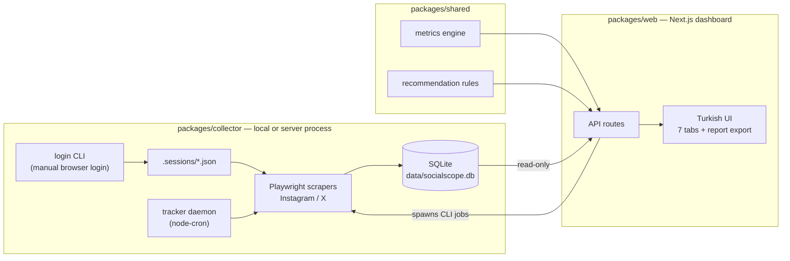

# SocialScope

**A self-hosted social media marketing analysis tool.** SocialScope scrapes
posts from your own Instagram/X accounts and your competitors', tracks new
posts' performance hour by hour, computes engagement metrics, benchmarks you
against competitors, and turns the data into concrete, evidence-cited
recommendations — all from a Turkish-language web dashboard, with no
third-party analytics service and no data leaving your machine.

> ⚠️ **Educational project.** Scraping social platforms sits against their
> terms of service. Use throwaway accounts, keep volumes low (the tool
> enforces this by design), and treat this as a portfolio/learning project,
> not a production SaaS.

## The problem

Small brands and creators want answers to marketing questions — *when should
I post? which format works? how do I compare to competitors? did that
campaign work?* — but platform-native analytics are siloed per account, show
nothing about competitors, and third-party tools are subscription services
that own your data. SocialScope answers those questions locally, from data it
collects itself.

## Features

- **Playwright scrapers** for Instagram and X with a shared base: logged-in
  sessions, human-like pacing (2–6 s randomized delays, scroll-based
  loading), realistic browser fingerprint, strictly sequential scraping
  enforced by a cross-process lock, and structural JSON harvesting that
  survives frontend changes far better than CSS selectors. All per-platform
  URLs/selectors/patterns live in one config file each.
- **Time-series tracker** (node-cron daemon): sweeps every registered account
  every 6 h, auto-enrolls fresh posts on your own accounts, snapshots each
  tracked post hourly (±10 min jitter) for its first 24 h, then 6-hourly,
  stopping at 48 h. Follower/following counts are captured as their own time
  series on every sweep. A daily *archive deepening* pass grows each
  account's post history by ~25 posts/day up to a cap, so history accumulates
  politely.
- **Metrics engine** (pure functions, unit-tested): engagement averages,
  engagement-per-view, posting frequency, day×hour performance heatmap in the
  audience's timezone, per-hashtag performance, caption-length buckets, media
  type breakdown — plus per-tracked-post time-series metrics: early velocity
  (first-3 h growth), peak growth hour, plateau detection, hour-by-hour
  deltas.
- **Rule-based recommendation engine** — no LLM, fully deterministic and
  auditable: best posting slot, format strategy, cadence benchmarked against
  competitors, hashtag strategy, follower-loss alerts, and per-1000-follower
  engagement comparison. Every recommendation cites the numbers it's based
  on.
- **Turkish web dashboard** (Next.js) with seven tabs: control panel
  (login/scrape/track jobs with live logs), per-account analysis with charts,
  side-by-side competitor benchmarking, recommendations, tracking growth
  curves with a first-24 h overlay, campaign tagging & measurement, and KPI
  goals with live progress.
- **One-page markdown report** of the entire analysis, downloadable from the
  dashboard.
- **Headless-server friendly**: log in on a desktop, download the session
  file from the dashboard, upload it on the server's dashboard — the server
  never needs a visible browser.

## Architecture



Three npm workspaces:

| Package | Role |
| --- | --- |
| `packages/shared` | TypeScript types, the metrics engine, and the recommendation rules — pure functions, fully unit-tested, no runtime dependencies |
| `packages/collector` | Playwright scrapers, login CLI, tracker daemon, SQLite migrations — the only writer of post/snapshot data |
| `packages/web` | Next.js dashboard: reads SQLite directly, triggers collector CLIs as background jobs, manages campaigns/goals/accounts |

## Tech stack

Node.js 20.12+ · TypeScript (strict) · npm workspaces · Playwright ·
better-sqlite3 (WAL) · node-cron · Next.js 16 (App Router) · React 19 ·
Tailwind CSS · Recharts · Vitest

## Getting started

```bash
npm install
npx playwright install chromium --no-shell   # one-time browser download
npm run migrate                              # create data/socialscope.db
npm run dev                                  # dashboard at http://localhost:3000
```

Then everything happens in the dashboard:

1. **Oturum** — click a platform's login button. A real browser window opens
   on this machine; log in normally (2FA works). The session is saved to the
   gitignored `.sessions/` folder and reused from then on. Your password
   never touches the app — only browser cookies are stored, locally.
2. **Veri Çekme** — pick a platform, enter a username, choose the role (my
   account / competitor) and start the scrape. The collector's log streams
   live into the page. Scraped accounts register automatically and appear as
   dashboard cards.
3. **Tracker** — run `npm run tracker` in a spare terminal (or as a service)
   for the time-series machinery: 6-hourly sweeps, hourly post snapshots,
   auto-enrollment of your fresh posts, daily archive deepening.
4. Explore the **Analiz / Karşılaştırma / Öneriler / Takip / Kampanyalar /
   Hedefler** tabs, and export everything with **Rapor İndir**.

CLI equivalents exist for scripting:

```bash
npm run login  -- --platform instagram|x
npm run scrape -- --platform instagram|x --user <account> --role me|competitor [--limit N] [--force]
npm run track  -- --url <post_url>
npm run tracker
npm run db:status
npm test
```

### Built-in throttles

Max 30 posts per default sweep (up to 100 for explicit archive backfill),
2–6 s human-like delays, one scrape session at a time globally (cross-process
lock file), a 6 h per-account sweep cache (`--force` overrides), one
account's archive deepened per day. Set `HEADED=1` to watch the scraper
browser work; `ARCHIVE_CAP` (default 100) bounds per-account history.

## Data model

SQLite (`data/socialscope.db`, WAL mode — the collector writes while the
dashboard reads). Migrations in `packages/collector/src/db/migrations/`.

| Table | Purpose |
| --- | --- |
| `posts` | One row per post ever seen: platform-scoped id (`instagram:<shortcode>` / `x:<tweet_id>`), author, role, timestamps, caption, media type, hashtags (JSON), URL, thumbnail URL |
| `snapshots` | Time series of each post's counters (likes/comments/shares/views) — one row per observation; every sweep and every tracker tick adds rows |
| `tracked_posts` | Posts enrolled in intensive tracking: start time, hard `auto_stop_at` (start + 48 h), active flag |
| `accounts` | The analysis registry: which accounts to sweep, and their role (me/competitor) |
| `account_snapshots` | Time series of profile stats: follower/following/post counts per sweep |
| `sweeps` | Last completed sweep per account — backs the 6 h cache |
| `campaigns`, `campaign_posts` | Named groups of posts measured together |
| `goals` | KPI targets per account; progress computed live from current metrics |

## Deployment (headless server / Coolify)

The only step that ever needs a screen is login — and sessions are portable:

1. On your desktop: log in via the dashboard, then **Oturum → İndir** to
   download `instagram.json` / `x.json`.
2. On the server's dashboard: **Oturum → Yükle** to upload them. Done — the
   server scrapes headlessly with those sessions. When a session expires,
   repeat.

**Plain server:** clone, `npm install`,
`npx playwright install chromium --no-shell --with-deps`, `npm run migrate`,
`npm run build`, then run `npm run start` (behind a reverse proxy) and
`npm run tracker` under a process manager (pm2/systemd).

**Docker / Coolify:** a [Dockerfile](Dockerfile) is included — it runs the
web dashboard and the tracker in one container. Point Coolify at the repo
(build with Dockerfile, not Nixpacks), expose port 3000, and attach
persistent volumes at `/app/data` and `/app/.sessions`. Note that scraping
from datacenter IPs draws more platform scrutiny than a home connection —
throwaway accounts matter even more there. The dashboard has no built-in
authentication; keep it behind a reverse-proxy auth layer or a private
network if the server is reachable from the internet.

## Testing

`npm test` runs the Vitest suite over the shared package: the metrics engine
(averages, heatmap timezone handling, hashtag/length grouping, time-series
velocity/peak/plateau math) and every recommendation rule's trigger
conditions — 35 tests.

## Screenshots

_Coming soon — dashboard, analysis charts, comparison table, tracking
curves._

## Project notes

Built as an internship project, developed stage by stage (monorepo skeleton →
scrapers → tracker → metrics → dashboards → report) with per-stage commits.
The LLM analysis layer originally planned was deliberately replaced with a
deterministic rule engine: recommendations that cite their evidence are more
trustworthy — and more testable — than generated prose.
